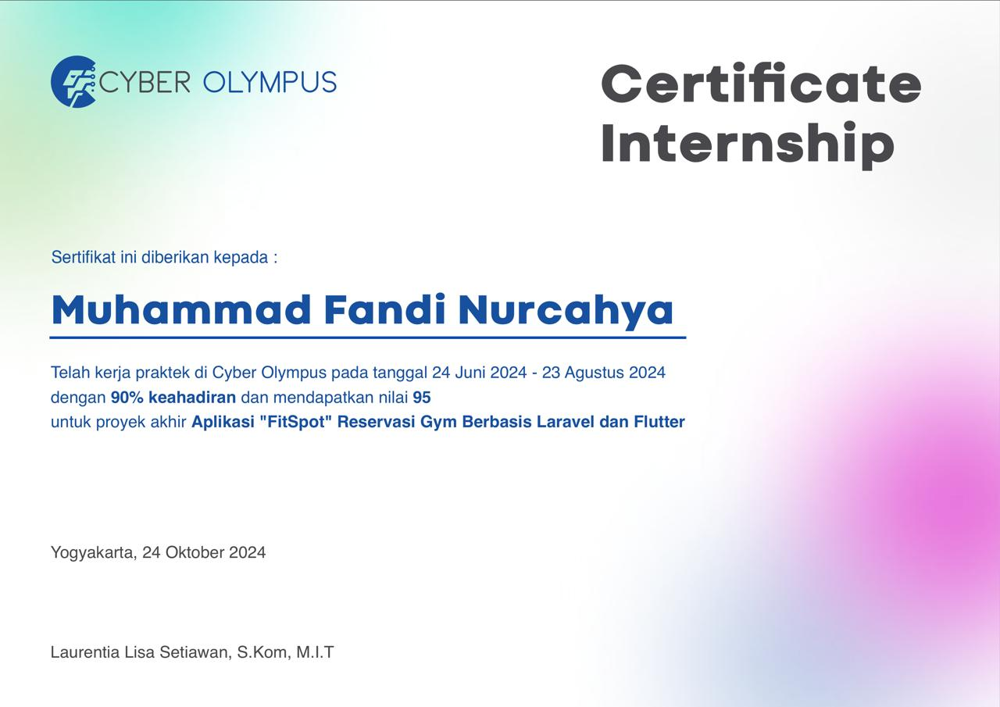

# 🏋️ Booking Gym App

## 📌 Deskripsi

Aplikasi **Booking Gym** berbasis mobile dengan **Flutter** yang terhubung ke **Laravel REST API** sebagai backend.
Fitur utama meliputi registrasi user, booking jadwal gym, serta laporan admin.

---

## 🚀 Tech Stack

* **Frontend (Mobile)** : Flutter (Dart)
* **Backend (API)** : Laravel 10+
* **Database** : MySQL
* **Authentication** : Laravel Sanctum / JWT

---

## 🎯 Fitur Utama

* 🔐 Registrasi & Login pengguna
* 📅 Booking jadwal gym sesuai ketersediaan
* 📊 Dashboard admin (laporan booking & user)

---

## 🛠️ Instalasi

### 1️⃣ Clone Repository

```bash
https://github.com/FandiCahya/PKL.git
cd PKL
```

### 2️⃣ Setup Backend (Laravel API)

```bash
composer install
cp .env.example .env
php artisan key:generate
php artisan migrate --seed
php artisan serve
```

### 3️⃣ Setup Mobile (Flutter)

```bash
cd mobile
flutter pub get
flutter run
```

---

## ⚙️ Konfigurasi

### 🔹 Konfigurasi Laravel `.env`

```env
APP_NAME=BookingGym
APP_ENV=local
APP_KEY=base64:your-key
APP_DEBUG=true
APP_URL=http://127.0.0.1:8000

DB_CONNECTION=mysql
DB_HOST=127.0.0.1
DB_PORT=3306
DB_DATABASE=booking_gym
DB_USERNAME=root
DB_PASSWORD=

SANCTUM_STATEFUL_DOMAINS=localhost
SESSION_DOMAIN=localhost
```

### 🔹 Konfigurasi API di Flutter

```dart
const String baseUrl = "http://127.0.0.1:8000/api";
```
---

## 📸  Sertifikat


---


