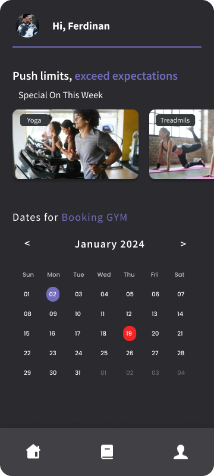

# Proyek Aplikasi FitSpot (PKL)

> Sebuah aplikasi Android untuk booking gym sebagai bagian dari Praktek Kerja Lapangan (PKL).

## deskripsi Singkat

Aplikasi Booking Gym yang memungkinkan pengguna untuk memesan jadwal gym secara online. Fitur utama mencakup registrasi pengguna, pemesanan jadwal, manajemen instruktur, dan laporan booking.

---

## ✨ Fitur Utama

Berdasarkan fungsionalitas yang ada, berikut adalah beberapa fitur utama dari aplikasi ini:

* **📈 Dashboard Pengguna:** Tampilan utama yang menampilkan informasi relevan (mungkin jadwal yang akan datang atau status booking).
* **🗓️ Pemilihan Jadwal:** Pengguna dapat melihat dan memilih jadwal yang tersedia (`Choose Jadwal.png`).
* **✅ Konfirmasi Booking:** Tampilan sukses setelah pengguna berhasil memesan jadwal (`Booked Success.png`).
* **🧾 Riwayat Pesanan:** Pengguna dapat melihat daftar pesanan atau booking yang pernah dilakukan (`My Order.png`).
* **👤 Manajemen Profil:** Pengguna dapat melihat (`My Profil.png`) dan mengubah data profil mereka (`Edit Profile.png`).
* **🎨 UI/UX Lainnya:** Termasuk aset untuk ilustrasi (`Workout-amico.svg`) dan ikon (`boxing.png`).

---

## 📸 Screenshot Aplikasi

Berikut adalah beberapa tampilan dari aplikasi:

| Dashboard | Pilih Jadwal | Booking Berhasil |
| :---: | :---: | :---: |
|  |  |  |

| Profil Saya | Edit Profil | Pesanan Saya |
| :---: | :---: | :---: |
|  |  |  |

*(Catatan: Path di atas mengasumsikan file README.md ini ada di folder yang sama dengan folder `assets` Anda. Jika struktur Anda adalah `[Root] / PKL / assets / ...` dan README ada di `[Root]`, Anda mungkin perlu mengubah path-nya menjadi `PKL/assets/img/Dashboard.png`)*

---

## 💻 Teknologi yang Digunakan

* **Frontend:** [Tulis teknologi frontend Anda, misal: Kotlin, XML, Jetpack Compose]
* **Backend:** [Tulis teknologi backend Anda, misal: Firebase, Node.js, atau API custom]
* **Database:** [Tulis database Anda, misal: Firestore, SQLite, MySQL]
* **Lainnya:** [Tulis library lain, misal: Retrofit, Glide, dll.]

---

## 🚀 Cara Menjalankan Proyek

Untuk menjalankan proyek ini secara lokal, ikuti langkah-langkah berikut:

1.  **Clone repositori:**
    ```bash
    git clone [URL_REPOSITORY_ANDA]
    cd [NAMA_FOLDER_PROYEK]
    ```
2.  **Buka di Android Studio:**
    * Buka Android Studio.
    * Pilih "Open an existing project".
    * Arahkan ke folder proyek yang baru saja Anda clone.
3.  **Install dependensi:**
    * Android Studio akan secara otomatis men-download semua *dependencies* yang diperlukan (pastikan Anda terhubung ke internet).
4.  **Konfigurasi API (jika ada):**
    * [Jelaskan jika ada file konfigurasi yang perlu disalin/dibuat, misal: `google-services.json` atau file `local.properties` untuk API key].
5.  **Jalankan aplikasi:**
    * Klik tombol 'Run' (►) dan pilih emulator atau perangkat fisik yang terhubung.

---

## 👤 Kontributor

* **[FandiCahya](https://github.com/FandiCahya)** - *Developer Utama*


